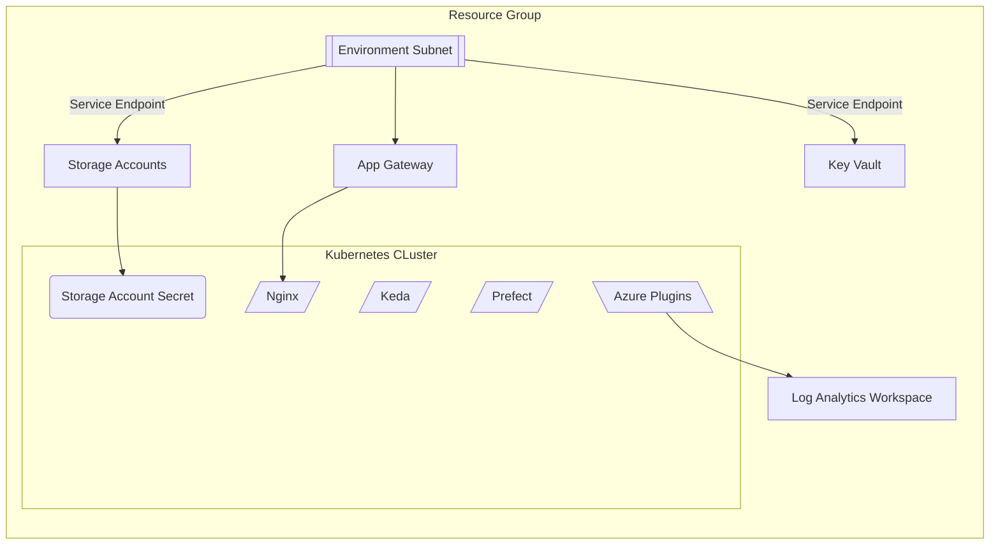
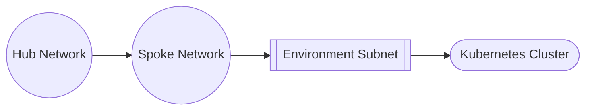

# Introduction
This repository provides terraform IaC scripts to deploy a new version of the SDE environment into azure (or other environments).

To future proof the repository the script is split into pathways for the environment it is to be hosted in, starting with azure. Equivalent scripts can then be created for alternative environments

Deployments of the infrastructure should be handled via git actions and deployed using job runners within the environment. However there are some manual tasks which may also need to be adhered to.

# Microsoft Azure
Deployment in this environment will create the following infrastructure



## Getting Started
### Networking Consideration
As the solution is designed for use within NHS networks, the expectation is that the network will be configured in a hub/spoke pattern. With the hub and spoke network VNET being build already and linked in via environment variables.



if you don't have a hub/spoke design to work from, you can set one up using the terraform in [./azure/01-hub-spoke-test](azure/01-hub-spoke-test).

This has no backend so you can simply useo the commands

```terraform
terraform init
terraform plan
terraform apply
```

### Terraform State
Once you have a network in place, you will need somewhere to store your terraform backend in state. You can either use an existing storage or you can provision a new storage account using the terraform in [./azure/02-state-store](./azure/02-state-store/)

### Core Infrastructure
Once you've got your network and terraform state sorted out you can provision the infrastructure using the core terraform scripts [./azure/03-core-infrastructure](./azure/03-core-infrastructure/).
