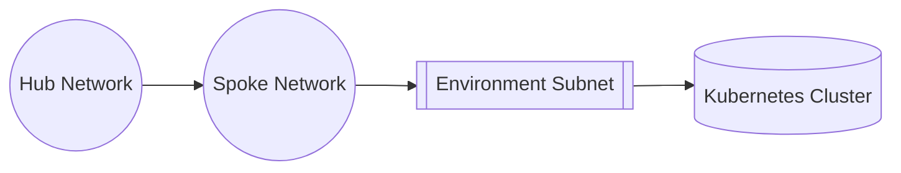

# Introduction
This repository provides terraform IaC scripts to deploy a new version of the SDE environment into azure (or other environments).

To future proof the repository the script is split into pathways for the environment it is to be hosted in, starting with azure. Equivalent scripts can then be created for alternative environments

Deployments of the infrastructure should be handled via git actions and deployed using job runners within the environment. However there are some manual tasks which may also need to be adhered to.

# Microsoft Azure
Deployment in this environment will create the following infrastructure

## Networking Consideration
As the solution is designed for use within NHS networks, the expectation is that the network will be configured in a hub/spoke pattern. With the hub and spoke network VNET being build already and linked in via environment variables.

