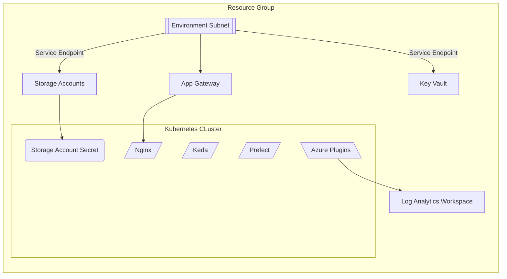
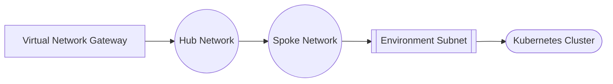

# Introduction
This repository provides terraform IaC scripts to deploy a new version of the SDE environment into azure (or other environments).

To future proof the repository the script is split into pathways for the environment it is to be hosted in, starting with azure. Equivalent scripts can then be created for alternative environments

Deployments of the infrastructure should be handled via git actions and deployed using job runners within the environment. However there are some manual tasks which may also need to be adhered to.

# Microsoft Azure
Deployment in this environment will create the following infrastructure



## Getting Started
### Networking Consideration
As the solution is designed for use within NHS networks, the expectation is that the network will be configured in a hub/spoke pattern. With the hub and spoke network VNET being build already and linked in via environment variables.



if you don't have a hub/spoke design to work from, you can set one up using the terraform in [./azure/01-hub-spoke-test](azure/01-hub-spoke-test).

To run this from your local machine, you must be logged in to az cli.

You will need to create an app registration inside of azure, this will be used to assign the relevant permissions to the service principle for deploying the terraform, this allows us to test the permissions overlay as part of the deployment.


You will need to configure a tfvars file for your environment

```
hub_address_space = "10.26.100.128/26"
location = "uksouth"
prefix = "test-network"
spoke_address_space = "10.26.104.0/25"
vpn_client_prefix = "10.0.242.0/24"
tenant_name = "LANDERTRE.onmicrosoft.com"
admin_password = "BadgerMushroom@1556"
private_dns_zone_name = "xlscsde.nhs.uk"
service_principal_id = "d4b1fc84-f1a1-4522-82d3-23c48ffb2c4c" # This is the object ID of the enterprise application for the app registration you created
```

Once this is applied you can run this using the tfvar files you created. Please note that even if this is run as a global administrator role you will need to assign the network contributor role to the executing user. This is because of changes in entra ID

```bash
terraform init
terraform plan --var-file=./variables/default.tfvars
terraform apply --var-file=./variables/default.tfvars
```

Please note that this will take approximately 20-30 minutes to deploy. 

Once it has completed it should output a load of variables giving information that can be used by scripts later. You should save this for later.

```
Outputs:

blob_storage_private_dns_zone_id = "/subscriptions/8580f07e-e369-4617-89c0-330764bf2118/resourceGroups/test-network-hub-network-rg/providers/Microsoft.Network/privateDnsZones/privatelink.blob.core.windows.net"
diagnostics_workspace_id = "/subscriptions/8580f07e-e369-4617-89c0-330764bf2118/resourceGroups/test-network-hub-network-rg/providers/Microsoft.OperationalInsights/workspaces/36t7p"
dns_server_ip_address = "10.26.100.164"
file_share_private_dns_zone_id = "/subscriptions/8580f07e-e369-4617-89c0-330764bf2118/resourceGroups/test-network-hub-network-rg/providers/Microsoft.Network/privateDnsZones/privatelink.file.core.windows.net"
hub_resource_group = "test-network-hub-network-rg"
hub_subnet_id = "/subscriptions/8580f07e-e369-4617-89c0-330764bf2118/resourceGroups/test-network-hub-network-rg/providers/Microsoft.Network/virtualNetworks/test-network-hub-network-vnet/subnets/test-network-hub-network-subnet"
hub_vnet_id = "/subscriptions/8580f07e-e369-4617-89c0-330764bf2118/resourceGroups/test-network-hub-network-rg/providers/Microsoft.Network/virtualNetworks/test-network-hub-network-vnet"
keyvault_private_dns_zone_id = "/subscriptions/8580f07e-e369-4617-89c0-330764bf2118/resourceGroups/test-network-hub-network-rg/providers/Microsoft.Network/privateDnsZones/privatelink.vaultcore.azure.net"
our_private_dns_zone_id = "/subscriptions/8580f07e-e369-4617-89c0-330764bf2118/resourceGroups/test-network-hub-network-rg/providers/Microsoft.Network/privateDnsZones/xlscsde.nhs.uk"
postgres_private_dns_zone_id = "/subscriptions/8580f07e-e369-4617-89c0-330764bf2118/resourceGroups/test-network-hub-network-rg/providers/Microsoft.Network/privateDnsZones/privatelink.postgres.database.azure.com"
spoke_resource_group = "test-network-spoke-network-rg"
spoke_subnet_id = "/subscriptions/8580f07e-e369-4617-89c0-330764bf2118/resourceGroups/test-network-spoke-network-rg/providers/Microsoft.Network/virtualNetworks/test-network-spoke-network-vnet/subnets/test-network-spoke-network-subnet"
spoke_subnet_nsg = "test-network-spoke-network-subnet"
spoke_vnet_id = "/subscriptions/8580f07e-e369-4617-89c0-330764bf2118/resourceGroups/test-network-spoke-network-rg/providers/Microsoft.Network/virtualNetworks/test-network-spoke-network-vnet"
subscription_id = "8580f07e-e369-4617-89c0-330764bf2118"
tenant_id = "ce97ca89-9ea2-41d7-81f0-fc095a5aac1f"
```

You can get the vpn client configuration using the following command in azure cli

```bash
az network vnet-gateway vpn-client generate -g test-network-hub-network-rg -n test-network-vpngw -o tsv
```
This will output a URL to the Azure VPN Configuration. You can then download this file which should download as vpnclientconfiguration.zip

This zip file will contain two folders:

* AzureVPN
* Generic

The file *azurevpnconfig.xml* in AzureVPN can be imported into Azure VPN client and used to connect to the environment. Azure VPN Client can be downloaded from the Microsoft Store.

Once you've downloaded and configured the Azure VPN you will need to connect to it in order to progress to the next phase.

Please be aware that because of the way azure P2S VPN works, the details of the VPN will change each time it is provisioned, as a result you will need to import the VPN configuration every time the gateway is provisioned. 

### Terraform State
Once you have a network in place, you will need somewhere to store your terraform backend in state. You can either use an existing storage or you can provision a new storage account using the terraform in [./azure/02-state-store](./azure/02-state-store/)

Again, you will need to fashion a tf vars file to go with this before you can apply it:

```
location = "uksouth"
prefix = "lscsdesbxstate"
tags = {
    "Environment" = "Sandbox",
    "Application Name" = "Secure Data Environment",
    "Project Name" = "TRE Environment",
    "Technical Contact" = "shaun.turner1@nhs.net",
    "ManagedBy" = "Research Software Design Authority",
    "Repository" = "https://github.com/lsc-sde/k8s-iac.git",
    "Budget - Billing Owner" = "healthierlsc.ICBAzureBillingAlerts@nhs.net",
    "Budget - Shared Resource" = "No",
    "Budget - Source" = "Revenue",
    "Budget - Cost Centre" = "TBC"
}
subnet_id = "/subscriptions/8580f07e-e369-4617-89c0-330764bf2118/resourceGroups/test-network-hub-network-rg/providers/Microsoft.Network/virtualNetworks/test-network-hub-network-vnet/subnets/test-network-hub-network-subnet"
ip_rules = []
hub_subscription_id = "8580f07e-e369-4617-89c0-330764bf2118"
subscription_id = "8580f07e-e369-4617-89c0-330764bf2118"
admin_group_id = "e012f43c-2d6b-4832-8865-f78e907c6be1"
private_zone_resource_group_name = "test-network-hub-network-rg"
```

Once this is applied you can run this using the tfvar files you created. Please note that even if this is run as a global administrator role you will need to assign the network contributor role to the executing user. This is because of changes in entra ID

```bash
terraform init
terraform plan --var-file=./variables/default.tfvars
terraform apply --var-file=./variables/default.tfvars
```

Upon completion this should output some variables which will fit into future scripts:

```
Outputs:

keyvault_name = "t2jsb-kvlt"
resource_group = "lscsdesbxstate-rg"
storage_account_name = "t2jsb850v8dppigbr3h653"
subscription_id = "8580f07e-e369-4617-89c0-330764bf2118"
tenant_id = "ce97ca89-9ea2-41d7-81f0-fc095a5aac1f"
```

Keep these in addition to the outputs from script 01 as they will be needed for the core infrastructure.

### Core Infrastructure
Once you've got your network and terraform state sorted out you can provision the infrastructure using the core terraform scripts [./azure/03-core-infrastructure](./azure/03-core-infrastructure/).

Once again you'll need to prepare an appropriate tfvars file
     
```

```

Once done you'll want to set the following variables:

```bash
export ARM_SUBSCRIPTION_ID="8580f07e-e369-4617-89c0-330764bf2118" # Output from 02 called subscription_id
export ARM_RESOURCE_GROUP_NAME="lscsdesbxstate-rg" # Output from 02 called resource_group
export ARM_STORAGE_ACCOUNT_NAME="t2jsb850v8dppigbr3h653" # Output from 02 called storage_account_name
export ARM_CONTAINER_NAME="terraform-state"
export ARM_KEY="core-infrastructure.tfstate"
```

You should then be able to run the terraform init command as follows:

```bash
terraform init -backend-config="subscription_id=${ARM_SUBSCRIPTION_ID}" -backend-config="resource_group_name=${ARM_RESOURCE_GROUP_NAME}" -backend-config="storage_account_name=${ARM_STORAGE_ACCOUNT_NAME}" -backend-config="container_name=${ARM_CONTAINER_NAME}" -backend-config="key=${ARM_KEY}"
```

Once this is done you should be able to call plan/apply as normal:

```bash
terraform plan --var-file=./variables/default.tfvars
terraform apply --var-file=./variables/default.tfvars
```

Once the apply is completed you should get an output as follows:

```
Outputs:

cluster_name = "hitcslscsde-k8s"
cluster_resource_group = "hitcslscsde-rg"
```

This can then be passed into az cli to configure kubectl to work with the cluster:

```
az aks get-credentials --resource-group <cluster_resource_group> --name <cluster_name> --overwrite-existing
kubelogin convert-kubeconfig -l azurecli --admin
```

example:

```bash
az aks get-credentials --resource-group hitcslscsde-rg --name hitcslscsde-k8s --overwrite-existing --admin
kubelogin convert-kubeconfig -l azurecli
```

You should then be able to query the cluster:

```bash
kubectl get pods -A
```

The cluster should also at this point also have fluxcd installed, and should be installing the flux configuration. It should be noted that there are a lot of components and that this can take some time to reconcile all of the components and get everything working. We would recommend leaving for a good hour before troubleshooting any issues.

### Certificates
